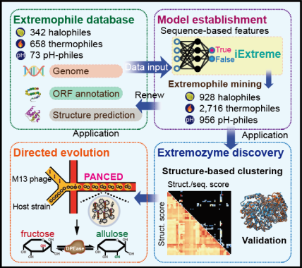

# iDEC 2024 | STU -China
## Background:

Extremophiles, known for their ability to thrive in extreme environments, are valuable for various applications ranging from material synthesis to environmental monitoring. However, identifying these microorganisms has traditionally been a laborious process, heavily reliant on manual screening methods. To address this challenge, the need for more efficient and accurate identification techniques has become essential.

## Results:

In response, we developed iExtreme, a comprehensive database containing 1,030 genomes of extremophiles across three categories, alongside a deep learning method for their identification. This method achieved an accuracy of up to 0.99 in predicting extremophile living conditions. Through **iExtreme**, we identified 520 previously unknown extremophilic species and 4,419 extremophilic genomes from various databases. Additionally, we utilized structure-based clustering to discover novel D-psicose 3-epimerases (DPEase) and α-amylases. To further enhance enzyme activity, we developed a directed evolution method using phage-assisted non-continuous evolution in droplets. The evolved DPEase demonstrated a 3-fold increase in activity, a 5.4-fold extension in half-life, and achieved the highest reported yield of 243 g/L D-allulose.

</img>

