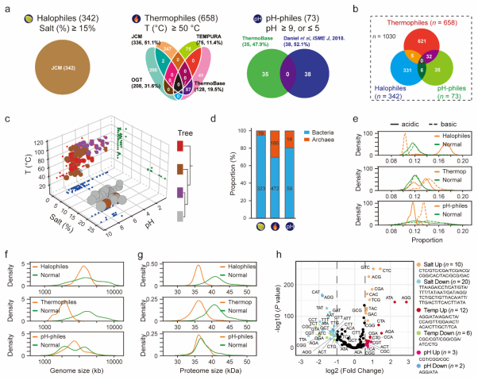
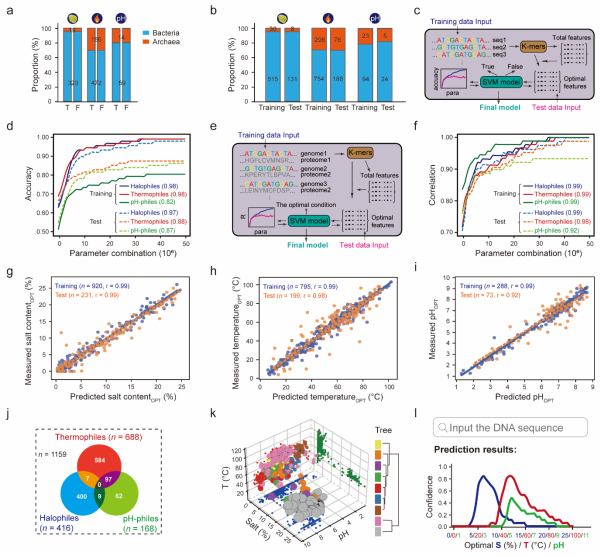
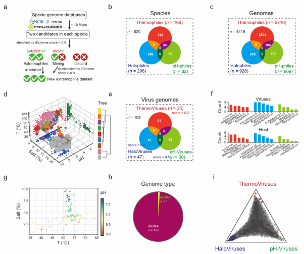
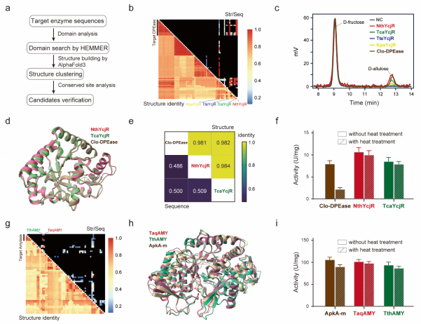
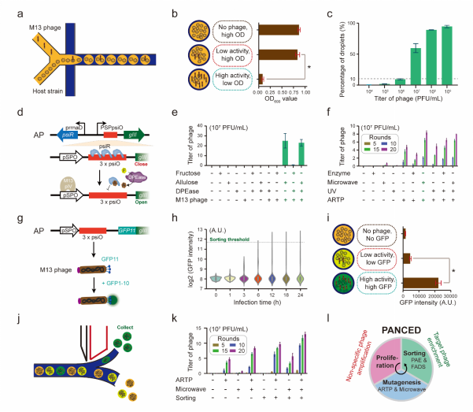
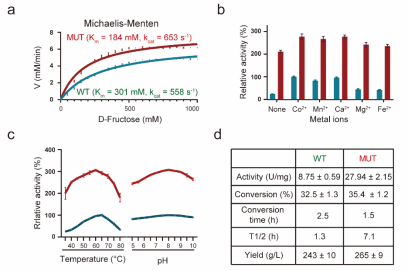

# Results
## 1. Establishment of genome and survival condition datasets for extremophiles
We collected and categorized a dataset of 1,030 extremophiles from various genomic databases, including halophiles, thermophiles, and pH-philes. Analysis showed that halophiles had a higher proportion of acidic amino acids compared to basic amino acids, while thermophiles and pH-philes exhibited the opposite trend. Additionally, thermophiles and pH-philes had a higher prevalence of aromatic amino acids. Extremophiles generally had smaller genome and proteome sizes, with thermophiles displaying more compact genomic functionality. Differences in tRNA minimum free energy and codon usage preferences across the extremophile types were also observed, providing valuable insights for the development of predictive models for extrem.

</img>

Fig.1 Extremophilic genome data collection and analysis.

                                                              
## 2.Establishment and refinement of the iExtreme model for extremophile identification
The iExtreme model was successfully developed by integrating 1,030 extremophilic genomes with non-extremophilic genomes to predict extremophiles and their optimal living conditions. Using SVM classification and k-mer feature extraction, the model achieved high prediction accuracies of 0.97 to 0.99 for halophiles, thermophiles, and pH-philes. Additionally, iExtreme re-predicted missing data, identifying 129 previously overlooked extremophiles. In total, the model identified 356 halophiles, 688 thermophiles, and 168 pH-philes, emphasizing the role of extreme environments in their evolution. To improve accessibility, an interactive website was created where users can input genomic data, and the model automatically predicts the species' optimal living conditions.

</img>

Fig.2 Establishment of deep learning model for extremophile identification.

## 3.Discovery of extremophiles using the iExtreme model
We applied the iExtreme model to predict and refine the genomic data from established databases, including NCBI, ProPan, ProGenome, and GOMC. Through this approach, we successfully identified a total of 1,166 extremophile genomes within the NCBI database, and classified 729 species as extremophiles. Altogether, we identified 520 new extremophilic species and 4,419 new extremophile genomes across all databases. Additionally, by applying iExtreme to viral genomes from the NCBI viral database, we discovered 47 haloviruses, 35 thermoviruses, and 30 pH-viruses, with 36 extreviruses included in our final database. Notably, most of the identified extremophilic viruses were DNA-based, particularly dsDNA, suggesting that DNA viruses exhibit higher tolerance to extreme conditions. We validated the accuracy of our model by confirming that the predicted optimal living conditions aligned with those observed in our collected extremophiles.

</img>

Fig.3 Extremophile screening using iExtreme.

## 4.Unveiling extremozymes through structure-based clustering within the iExtreme database
we utilized structure-based clustering within the iExtreme database to discover new extremozymes. We focused on two key industrial enzymes, D-psicose 3-epimerase (DPEase) and α-amylase. By applying our clustering method, we identified 136 potential DPEases and selected four candidates with high structural similarity but low sequence homology. After testing, we found that NthYcjR and TcaYcjR displayed strong DPEase activity and excellent thermostability, surpassing the widely used Clo-DPEase under high-temperature conditions. Using the same approach, we discovered novel α-amylases from Thermospira aquatica and Thermoanaerobacter thermocopriae, which showed similar activity and thermostability to known thermophilic α-amylases. These findings demonstrate the effectiveness of structure-based clustering in identifying new extremozymes with great potential for industrial applications.

</img>

Fig.4 Novel extremozyme discovery using iExtreme and structure-based clustering.

## 5.Developing a droplet-based PANCE method for the directed evolution of DPEase
We developed a droplet-based phage-assisted non-continuous evolution (PANCE) method for the directed evolution of D-psicose 3-epimerase (DPEase). We designed a microfluidic chip to encapsulate M13 phages and E. coli host strains in droplets, ensuring each droplet contained one phage. Using this method, we successfully evolved Clo-DPEase by linking DPEase activity to the expression of M13 phage gene gIII in response to D-allulose concentration.

We further explored the use of physical mutagenesis techniques, including ARTP and microwave, to accelerate the evolution process, reaching a plateau by round 15-20. Additionally, we applied fluorescence-activated droplet sorting (FADS) to select high-activity phage mutations, significantly speeding up the PANCE process by two-fold.

As a result, we isolated a Clo-DPEase mutant, Phe246Tyr (Clo-DPEasemut), which exhibited a 1.9-fold higher catalytic efficiency (kcat/Km) compared to the wild type. The mutant also demonstrated enhanced stability and a longer half-life, retaining more than 28.5% conversion rate after four uses in the industrial production of allulose, with a peak yield of 265 g/L. These findings highlight the potential of Clo-DPEasemut for industrial applications.

</img>

Fig.5 Establishment and optimization of PANCED for directed evolution of DPEase.

</img>

Fig.6 Enzyme performance comparison of Clo-DPEase WT and MUT.

